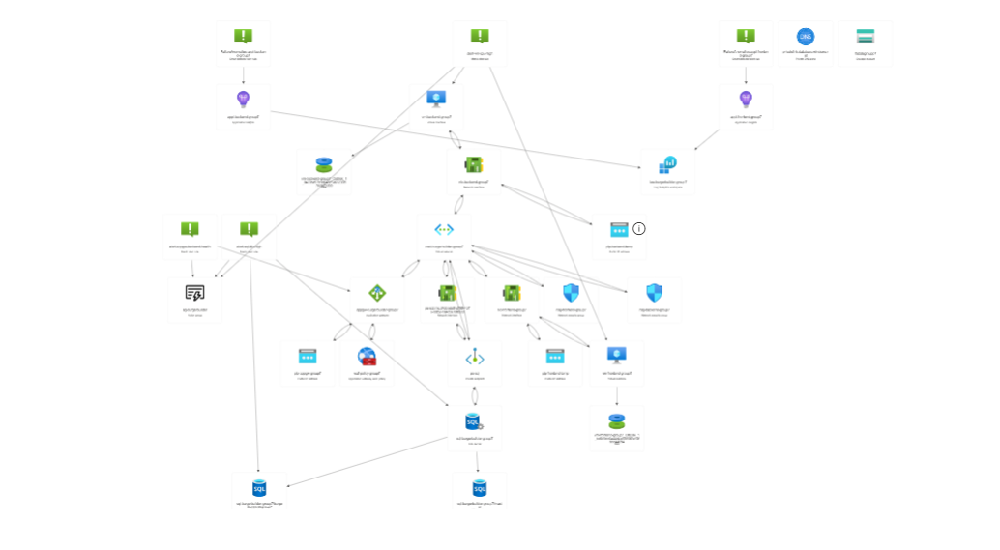

# 🍔 Burger Builder — Production 3-Tier Azure Architecture

A full-stack web application deployed on a secure, scalable 3-tier Azure architecture with full automation via Terraform, Ansible, and GitHub Actions.

## 🏗️ Architecture Overview

```
Internet → Application Gateway (WAF v2) → Frontend VM (Nginx + React)
                                        → Backend VM (Java Spring Boot)
                                              ↓
                                        Azure SQL (Private Endpoint only)
```

All resources live inside a private VNet. No VM has a public IP. SQL is only reachable via Private Endpoint. The App Gateway is the single public entry point.



## 🌐 Live URLs

| Service | URL |
|---|---|
| Frontend | http://40.67.225.150 |
| API Health | http://40.67.225.150/api/health |
| API Ingredients | http://40.67.225.150/api/ingredients |

## 📋 Prerequisites

- Azure CLI (`az login` working)
- Terraform >= 1.5
- Ansible >= 2.14
- Node.js 20+
- Java 21 + Maven
- Git + GitHub account
- Azure subscription with Contributor access

## 🗂️ Repository Structure

```
devops-project2-ih/
├── frontend/                        # React + TypeScript + Vite
├── backend/                         # Spring Boot Java REST API
├── infra/terraform/
│   ├── environments/dev/            # Dev environment entry point
│   │   ├── main.tf                  # Provider, backend, module calls
│   │   ├── variables.tf             # Variable declarations
│   │   └── terraform.tfvars         # Variable values (gitignored)
│   └── modules/
│       ├── network/                 # VNet, subnets, NSGs
│       ├── compute/                 # Frontend + backend VMs
│       ├── database/                # Azure SQL + Private Endpoint
│       ├── appgateway/              # App Gateway WAF v2
│       └── monitoring/              # App Insights, Log Analytics, Alerts
├── config/ansible/
│   ├── inventories/dev/hosts.yml    # VM inventory
│   ├── roles/common/                # Base VM setup
│   ├── roles/frontend/              # Nginx + React deployment
│   ├── roles/backend/               # Java + Spring Boot deployment
│   └── site.yml                     # Main playbook
├── .github/workflows/
│   ├── infra.yml                    # Terraform pipeline
│   ├── frontend.yml                 # Frontend CI/CD
│   └── backend.yml                  # Backend CI/CD
├── docs/
│   ├── architecture-diagram.png
│   └── runbook.md
└── README.md
```

## 🔧 How to Provision (Terraform)

### 1. Create Terraform Remote State Storage

```bash
az group create --name rg-tfstate --location northeurope

az storage account create \
  --name tfstatefidail \
  --resource-group rg-tfstate \
  --sku Standard_LRS \
  --location northeurope

az storage container create \
  --name tfstate \
  --account-name tfstatefidail \
  --auth-mode login
```

### 2. Create SSH Key Pair

```bash
ssh-keygen -t rsa -b 4096 -f ~/.ssh/burgerbuilder -N ""
```

### 3. Configure Variables

```bash
cp infra/terraform/environments/dev/terraform.tfvars.example \
   infra/terraform/environments/dev/terraform.tfvars
```

Edit `terraform.tfvars` with your values:

```hcl
resource_group_name = "rg-burgerbuilder-dev"
location            = "northeurope"
admin_username      = "azureuser"
ssh_public_key      = "ssh-rsa AAAA..."
vm_size             = "Standard_D2ads_v7"
sql_server_name     = "sql-burgerbuilder-yourname"
sql_database_name   = "burgerbuilderdb"
sql_admin_username  = "sqladmin"
sql_admin_password  = "YourPassword123!"
alert_email         = "your@email.com"
```

### 4. Apply Infrastructure

```bash
cd infra/terraform/environments/dev
terraform init
terraform plan
terraform apply
```

This creates: VNet, 5 subnets, NSGs, 2 VMs, Azure SQL, Private Endpoint, Private DNS, App Gateway (WAF v2), App Insights, Log Analytics, 3 Alert rules.

### 5. Terraform Workspaces

```bash
# Create prod workspace
terraform workspace new prod
terraform workspace select prod
terraform apply -var-file="../../environments/prod/terraform.tfvars"
```

## ⚙️ How to Configure (Ansible)

### 1. Update Inventory

Edit `config/ansible/inventories/dev/hosts.yml` with your VM IPs:

```yaml
all:
  children:
    frontend:
      hosts:
        vm-frontend:
          ansible_host: <frontend-private-ip>
          ansible_user: azureuser
          ansible_ssh_private_key_file: ~/.ssh/burgerbuilder
    backend:
      hosts:
        vm-backend:
          ansible_host: <backend-private-ip>
          ansible_user: azureuser
          ansible_ssh_private_key_file: ~/.ssh/burgerbuilder
```

### 2. Run Playbook

```bash
# Configure all VMs
ansible-playbook config/ansible/site.yml \
  -i config/ansible/inventories/dev/hosts.yml \
  --private-key ~/.ssh/burgerbuilder

# Configure only frontend
ansible-playbook config/ansible/site.yml \
  -i config/ansible/inventories/dev/hosts.yml \
  --limit frontend \
  --private-key ~/.ssh/burgerbuilder \
  --extra-vars "frontend_build_path=frontend/dist/"

# Configure only backend
ansible-playbook config/ansible/site.yml \
  -i config/ansible/inventories/dev/hosts.yml \
  --limit backend \
  --private-key ~/.ssh/burgerbuilder \
  --extra-vars "backend_jar_path=backend/target/burger-builder-backend-1.0.0.jar"
```

## 🚀 How to Deploy (GitHub Actions)

### 1. Add GitHub Secrets

Go to: **GitHub repo → Settings → Secrets and variables → Actions**

| Secret | Description |
|---|---|
| `ARM_CLIENT_ID` | Azure Service Principal Client ID |
| `ARM_CLIENT_SECRET` | Azure Service Principal Secret |
| `ARM_TENANT_ID` | Azure Tenant ID |
| `ARM_SUBSCRIPTION_ID` | Azure Subscription ID |
| `AZURE_CREDENTIALS` | Full JSON credentials block |
| `SSH_PRIVATE_KEY` | Contents of `~/.ssh/burgerbuilder` |
| `SSH_PUBLIC_KEY` | Contents of `~/.ssh/burgerbuilder.pub` |
| `SQL_ADMIN_PASSWORD` | SQL Server admin password |
| `APPGW_PUBLIC_IP` | App Gateway public IP address |

### 2. Create Service Principal

```bash
az ad sp create-for-rbac \
  --name "sp-burgerbuilder-github" \
  --role contributor \
  --scopes /subscriptions/<subscription-id>/resourceGroups/<rg-name>
```

### 3. Run Pipelines

**Infrastructure pipeline** (Terraform):
```
GitHub → Actions → Infrastructure → Run workflow
```

**Frontend pipeline** (Build + Deploy):
```
GitHub → Actions → Frontend CI/CD → Run workflow
```

**Backend pipeline** (Build + Deploy):
```
GitHub → Actions → Backend CI/CD → Run workflow
```

Pipelines also trigger automatically on push to `main` when files in their respective paths change.

## ✅ How to Validate

### 1. Check App is Live

```bash
# Frontend
curl http://<appgw-ip>/

# API Health
curl http://<appgw-ip>/api/health

# Ingredients from SQL
curl http://<appgw-ip>/api/ingredients
```

### 2. End-to-End SQL Test

```bash
# Add to cart
curl -X POST http://<appgw-ip>/api/cart/items \
  -H "Content-Type: application/json" \
  -d '{"ingredientId":1,"quantity":1,"sessionId":"test123"}'

# Create order (use cart item ID from above response)
curl -X POST http://<appgw-ip>/api/orders \
  -H "Content-Type: application/json" \
  -d '{"sessionId":"test123","cartItemIds":[1],"totalPrice":1.50,"customerName":"Test User"}'

# Read order back from SQL
curl http://<appgw-ip>/api/orders/history
```

### 3. Verify Security

```bash
# VMs should have NO public IPs
az vm list-ip-addresses \
  --resource-group <rg-name> \
  --query "[].{vm:virtualMachine.name, publicIP:virtualMachine.network.publicIpAddresses[0].ipAddress}" \
  --output table

# SQL public access should be disabled
az sql server show \
  --name <sql-server-name> \
  --resource-group <rg-name> \
  --query publicNetworkAccess
```

### 4. Sample Kusto Queries (Log Analytics)

```kusto
-- App Gateway requests last 1 hour
AzureDiagnostics
| where ResourceType == "APPLICATIONGATEWAYS"
| where TimeGenerated > ago(1h)
| summarize count() by httpStatus_d

-- Backend errors
AppExceptions
| where TimeGenerated > ago(1h)
| order by TimeGenerated desc
```

## 📊 Monitoring

### Alerts Configured

| Alert | Trigger | Severity |
|---|---|---|
| App Gateway Backend Health | UnhealthyHostCount > 0 for 5 min | 2 (Warning) |
| VM CPU High | CPU > 70% for 5 min | 2 (Warning) |
| SQL DTU High | DTU > 80% for 5 min | 2 (Warning) |

All alerts send email notifications to the configured `alert_email`.

### Application Insights

- Frontend instrumentation via `appi-frontend`
- Backend instrumentation via `appi-backend`
- Both connected to shared Log Analytics workspace

## 🔐 Security

- VMs have **no public IPs** — only accessible from App Gateway subnet or ops subnet
- SQL Server has **public network access disabled** — only reachable via Private Endpoint
- NSGs restrict inbound traffic per tier
- SSH locked to ops subnet (snet-ops) only
- WAF v2 in Detection mode on App Gateway
- Secrets stored in GitHub Actions secrets, never in code

## 🗺️ 3-Tier Network Layout

| Subnet | CIDR | Purpose |
|---|---|---|
| snet-appgw | 10.0.0.0/24 | Application Gateway |
| snet-frontend | 10.0.1.0/24 | Frontend VM |
| snet-backend | 10.0.2.0/24 | Backend VM |
| snet-data | 10.0.3.0/24 | SQL Private Endpoint |
| snet-ops | 10.0.4.0/24 | Bastion / GitHub Runner |

## 🎬 Demo Script (3-5 min walkthrough)

1. **Show architecture diagram** — explain 3 tiers, private networking, single public entry
2. **Open browser** at `http://40.67.225.150` — show Burger Builder UI loading
3. **Show ingredients loading** — prove frontend → App Gateway → backend → SQL flow
4. **Run curl commands** — create cart item, create order, read order history from SQL
5. **Show GitHub Actions** — 3 green pipelines (infra, frontend, backend)
6. **Show Azure Portal** — resource group with all expected services
7. **Show monitoring** — App Insights, Log Analytics workspace, 3 alert rules
8. **Show Terraform state** — remote state in Azure Storage
9. **Show NSGs** — no public access to VMs
10. **Show SQL** — public network access disabled

## 📦 Tech Stack

| Layer | Technology |
|---|---|
| Frontend | React 19, TypeScript, Vite |
| Backend | Java 21, Spring Boot 3.2, Maven |
| Database | Azure SQL Database |
| Infrastructure | Terraform + Azure RM Provider |
| Configuration | Ansible |
| CI/CD | GitHub Actions |
| Networking | Azure VNet, NSGs, Private Endpoints |
| Gateway | Azure Application Gateway WAF v2 |
| Monitoring | Azure App Insights + Log Analytics |
| Secret Storage | GitHub Actions Secrets |
